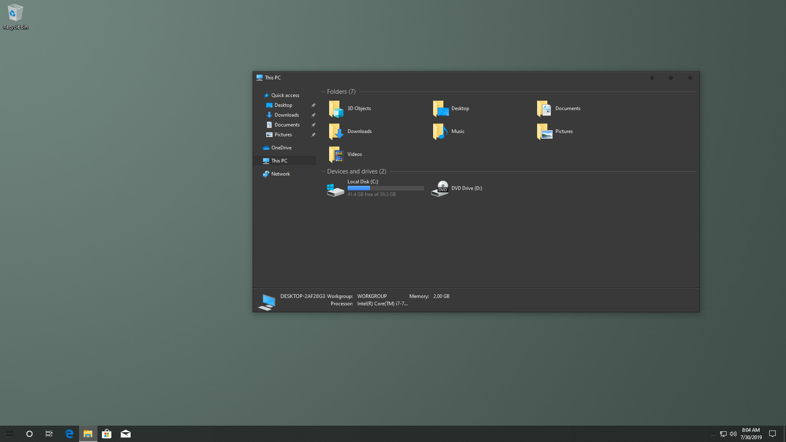

# WinIconPatcher

   

## About

WinIconPatcher is a piece of software that replaces icons in windows system files.

## Features

* Free and Open Source (FOSS)
* Compatible with 7TSP Icon Packs
* Probably quite future-proof

## Limitations

* Installing feature updates on windows resets the icons, so you have to apply them again after installing a feature update, which is rolled out once each year.
* Not necessarily a limitation, but the project uses Resource Hacker, which is known to be safe but is closed source. If you know about a command line program or a library that can do this better, please let me know.

## Operating System Support\*

* Windows 7? (Untested, but should work)
* Windows 8.1
* Windows 10 (tested: 1507, 1607, 1809, 1903, 1909, 2004, 20H2, 21H1, 21H2, 20348.*)
* Windows 11 (tested: 21H2, 22H2)
* Future versions\*\*

## Download

[Latest release](https://github.com/ItsProfessional/WinIconPatcher/releases/latest/download/IconTool.exe)

[Development builds](https://github.com/ItsProfessional/WinIconPatcher/actions)

[Scoop:](https://scoop.sh/)
```shell
scoop bucket add extras
scoop install winiconpatcher
```

## Download is MALWARE???

Some silly antiviruses tend to flag the tool as malware, because it's unsigned (this method of detection [clearly](https://www.securityweek.com/use-fake-code-signing-certificates-malware-surges) [works](https://www.zdnet.com/article/hackers-are-selling-legitimate-code-signing-certificates-to-evade-malware-detection/) [btw](https://web.archive.org/web/20200720160419/http://signedmalware.org/). I'm submitting all releases before release to Microsoft for analysis if they're detected by Defender, but I can't guarantee the same for all the other AVs. If you have a signing certificate and are willing help signing, please contact me.

### But I still don't trust it.

Compile it yourself.

## Screenshot

Program:


Here's a cool icon pack for illustration:



[Icon pack used](https://www.deviantart.com/niivu/art/foobar)

## Where to get icon packs

I recommend [DeviantArt](https://www.deviantart.com/tag/windows10themes) for finding icon packs, although it is a bit noisy. Alternatives are [7themes.su](https://7themes.su/) which is much more organized (but be wary of fake adware download buttons! use the one that says Яндекс.Диск). Also, you can just search for icon packs with your favorite search engine. Make sure that the icon pack you're about to apply is compatible with your windows version.

## Frequently Asked Questions

### **Q: Help, WinIconPatcher broke my windows install**

A: [Help: System files damaged after WinIconPackager](https://github.com/ItsProfessional/WinIconPatcher/wiki/Help:-Login-loop-after-installing-WinIconPatcher)

---

### **Q: I just want a themed Windows, what do I do with all this?**

A: [Help: Step by step installing WinIconPatcher and a custom icon pack](https://github.com/ItsProfessional/WinIconPatcher/wiki/Help:-Step-by-step-installing-WinIconPatcher-and-a-custom-icon-pack)

---

### **Q: Can you make icon packs per-program?**

A: Unfortunately, this is probably impossible.

## Is it WinIconPatcher or IconTool? And what does it stand for anyways?

WinIconPatcher is the project, which includes IconTool and IconLib. IconTool is the patcher / UI component.

IconLib is a library that can be used by developers to implement this project's icon patching in their software.

## Building

### Requirements

* Visual Studio 2022 (or above)

### Compiling

Note that the order of the builds is important, building IconTool will fail if some architecture is missing WinIconPatcher build.

1. Open WinIconPatcher.sln
2. Build IconTool as Release/Win32

### Debugging

Idk

## License

See the [LICENSE](LICENSE) file.

## Credits

When I started writing this program, I had little C++ knowledge, let alone with the Windows API. Because of which, I based my project off of an already existing project, called [SecureUxTheme](https://github.com/namazso/SecureUxTheme). Therefore, much of this code can be attributed to the code of the [SecureUxTheme](https://github.com/namazso/SecureUxTheme) project up to [this commit](https://github.com/namazso/SecureUxTheme/commit/f14e3f0afcfdb95f31855cda4792acdf62820d83).
